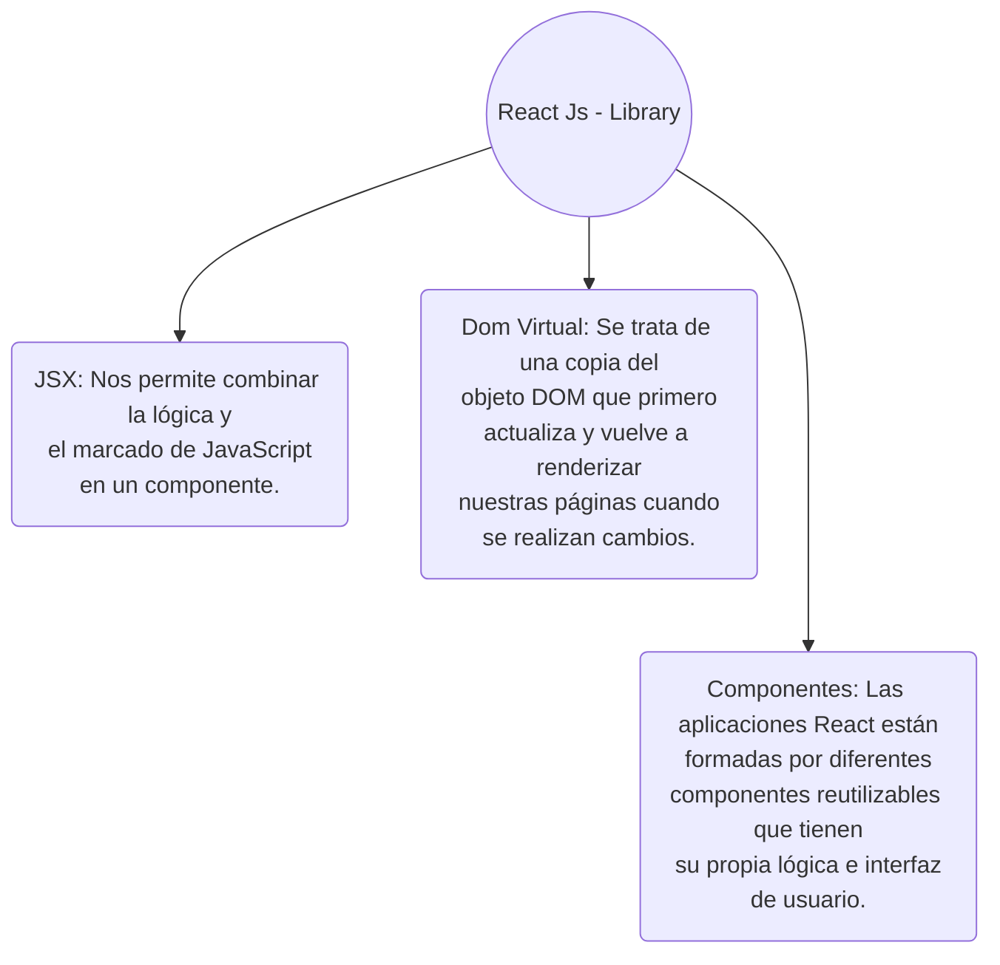

# Caracteristicas de React

```mermaid {theme: 'dark', scale: 0.8}
flowchart TB
  B(( React Js - Library ))
  
  B((React Js - Library))-->C(JSX: Nos permite combinar la lógica y<br> el marcado de JavaScript en un componente.)

  B((React Js - Library))-->D(Dom Virtual: Se trata de una copia del<br> objeto DOM que primero actualiza y vuelve a renderizar<br> nuestras páginas cuando se realizan cambios.)

  B((React Js - Library))--->E(Componentes: Las aplicaciones React están<br> formadas por diferentes componentes reutilizables que tienen<br> su propia lógica e interfaz de usuario. )
```