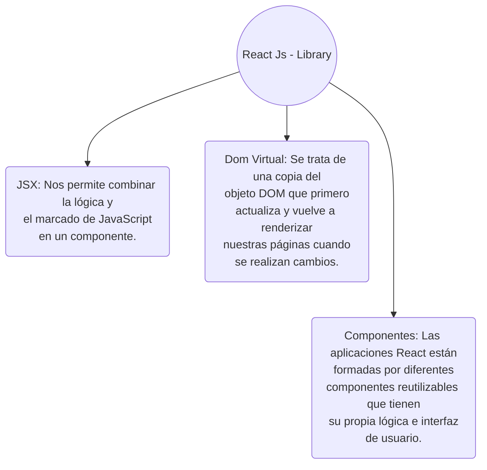

# React Js

La libreria Top de JavaScript para crear interfaces de usuario.

---

# Que es React?

<p>

  React es una librería Open Source (Código abierto) creada con la finalidad de facilitar la creación de interfaces de usuarios utilizando **_componentes_**.

  Toda aplicación web React se construye a partir de **_componentes reutilizables_** que conforman partes de la interfaz de usuario — podemos tener un componente distinto para nuestra barra de navegación, otro para el pie de página, otro para el contenido principal, etc.

  En la mayoría de los casos, la **sintaxis** utilizada para construir aplicaciones React se llama JSX (JavaScript XML), que es una extensión de la sintaxis de JavaScript.

  Con JSX, eliminamos la necesidad de interactuar con el DOM.

</p>

 ```javascript
  const navbar = document.getElementById('nav');
  const footer = document.querySelector('footer')
  ```
  👉🏽 [Documentación oficial](https://es.reactjs.org/)

  👉🏽 [Documentación Beta](https://beta.es.reactjs.org/)


<style>
h1 {
  background-color: #2B90B6;
  background-image: linear-gradient(45deg, #4EC5D4 10%, #146b8c 20%);
  background-size: 100%;
  -webkit-background-clip: text;
  -moz-background-clip: text;
  -webkit-text-fill-color: transparent;
  -moz-text-fill-color: transparent;
}
</style>

---

# Caracteristicas de React


---
layout: image-right
image: /assets/pixeltrue-web-development.svg
---

# Como instalar React ?
<div></div>
<p>
Verificamos que tenemos instalado NodeJs
</p>

```
node -v
```

<p>
Luego, en nuestra carpeta de preferencia, ejecutamos el comando:
</p>

```
npx create-react-app app-name
```

<p>
Una vez completada la instalación, abre la carpeta de React recién instalada, y ejecutamos el comando
</p>

```
npm run start
```
<style>
h1 {
  background-color: #2B90B6;
  background-image: linear-gradient(45deg, #4EC5D4 10%, #146b8c 20%);
  background-size: 100%;
  -webkit-background-clip: text;
  -moz-background-clip: text;
  -webkit-text-fill-color: transparent;
  -moz-text-fill-color: transparent;
}
</style>

---

# Estructura de carpetas
<div grid="~ cols-2 gap-4">
<div class="~ ">

La estructura de carpetas está organizada de la siguiente manera:

<br>


</div>
</div>
---
